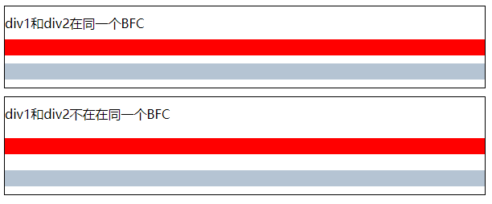
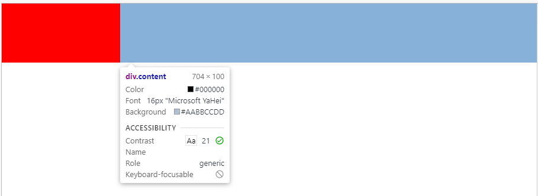
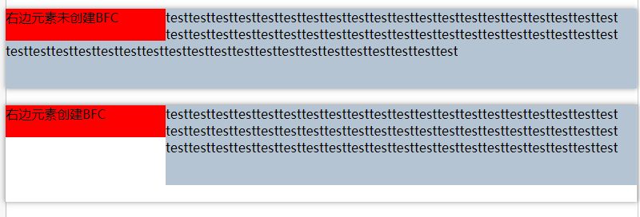
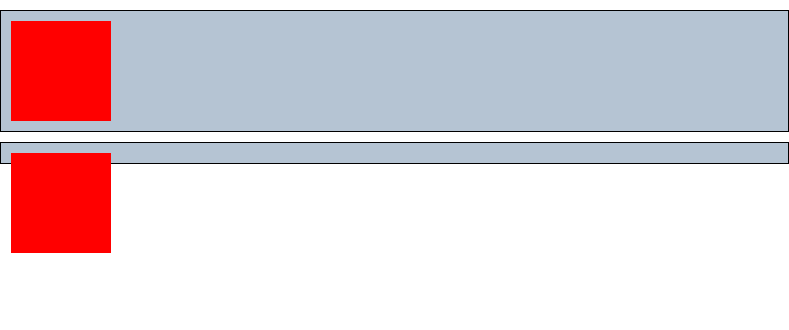

### 什么是BFC?
MDN的定义: 
> BFC即块格式化上下文(Block Formatting Context), 是web页面的可视CSS渲染的一部分, 是块级盒子的布局过程发生的区域, 也是浮动元素与其他元素交互的区<br>

简单来说就是: 
> BFC是一个独立的布局环境, BFC内部的元素布局与外部互不影响.<br>

在实际应用中, 我们经常使用到BFC, 只是可能我们不知道这个东西原来叫做BFC.


### BFC的触发条件(怎么创建一个BFC)
常见的方式有以下几种:
- 根元素(<html>)
- 浮动元素`float`的值不为`none`
- 绝对定位元素`position`的值为`fixed`或者`absolute`
- `over-flow`的值**不为**`visible`, `clip`的**块元素**
- display的值为`inline-block`, `table-cell`, `flex`, `inline-flex`等
- ...

(更详细的触发条件可以查看[MDN的详解](https://developer.mozilla.org/zh-CN/docs/Web/Guide/CSS/Block_formatting_context))
### BFC的特性
1. BFC内部的块级元素会从顶端开始垂直的一个接一个的排列(就算不在BFC中也是垂直排列...)
2. 同属于一个BFC的两个块级元素的上下margin会重叠, 以较大的值为准;
3. BFC的区域不会与浮动的元素区域重叠, 也就是说不会与浮动盒子产生交集(重叠), 而是紧贴浮动边缘
4. 计算BFC的高度时, 浮动元素也会参与计算(可以利用这个特性清除浮动)
5. BFC就是页面上一个隔离的独立容器, 容器内外的元素互不影响

### 常见的应用场景
1. 解决外边距margin重叠的问题
原理: 不属于同一个BFC的块级元素的外边距margin不会重叠<br>


```html
<div class="test">
    <div>div1和div2在同一个BFC</div>
    <div class="div1"></div>
    <div class="div2"></div>
</div>
<div class="test">
    <div>div1和div2不在在同一个BFC</div>
    <div class="wrapper">
        <div class="div1"></div>
    </div>
    <div class="div2"></div>
</div>
<style>
    .test {
        overflow: auto;
        border: 1px solid;
    }
    div {
        margin: 10px 0;
    }
    .div1 {
        background-color: red;
        height: 20px;
    }
    .div2 {
        background-color: #abcd;
        height: 20px;
    }
    .wrapper {
        overflow: auto;
    }
</style>
```

2. 实现自适应的两栏布局
原理: BFC的区域不会不会与浮动盒子产生交集(重叠)<br>


```html
<!-- 2.两栏布局 -->
<div class="left">
</div>
<div class="content">
</div>
<style>

    .left {
        background-color: red;
        width: 200px;
        height: 100px;
        
        float: left; 
    }
    .content {
        background-color: #abcd;
        height: 100px;
        /* overflow触发BFC, BFC的区域不会与浮动的元素区域重叠 */
        overflow: hidden;
    }
</style>
```

3. 解决文字环绕
原理: BFC的区域不会不会与浮动盒子产生交集(重叠)<br>


```html
<div class="left">
    右边元素创建BFC
</div>
<div class="content">
    testtesttesttesttesttesttesttesttesttesttesttesttesttesttesttesttesttesttesttest
    testtesttesttesttesttesttesttesttesttesttesttesttesttesttesttesttesttesttesttest
    testtesttesttesttesttesttesttesttesttesttesttesttesttesttesttesttesttesttesttest
</div>
<style>
    .left {
        background-color: red;
        width: 200px;
        height: 40px;
        
        float: left; 
    }
    .content {
        background-color: #abcd;
        height: 100px;
        /* overflow触发BFC, BFC的区域不会与浮动的元素区域重叠, 从而解决文字环绕 */
        overflow: hidden;
    }
</style>
```

4. 清除浮动
原理: 计算BFC的高度时, 浮动元素也会参与计算<br>

```html
<div class="father">
    <div class="content"></div>
</div>
<div class="father" style="overflow: visible;">
    <div class="content"></div>
</div>
<style>
    .father {
        background-color: #abcd;
        border: 1px solid;
        padding: 10px;
        margin: 10px 0;
        /* 创建BFC 利用BFC特性撑开高度 */
        overflow: auto;
    }
    .content {
        background-color: red;
        width: 100px;
        height: 100px;
        float: left;
    }
</style>
```


### 参考文章 && 相关文章
- [MDN-块格式化上下文](https://developer.mozilla.org/zh-CN/docs/Web/Guide/CSS/Block_formatting_context)
- [博客园-CSS中的BFC详解](https://www.cnblogs.com/chen-cong/p/7862832.html)
- [知乎-一次弄懂CSS的BFC](https://zhuanlan.zhihu.com/p/127187654)
- [掘金-CSS中的BFC是什么？怎么用？](https://juejin.cn/post/7031065166317879310)