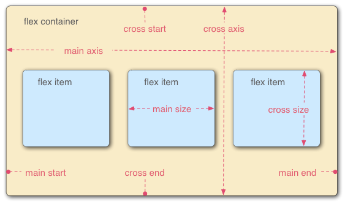

### 基本概念
- 主轴:
    - main-axis(水平主轴)
    - cross-axis(垂直交叉轴)
- 单元块
    - flex-item
- 占据空间
    - main-size 主轴空间
    - cross-size 交叉轴空间
### flex容器声明
- `display: flex | inline-flex`
> 注意: 声明flex容器后, 子元素的float, clear, vertical-align属性将会失效

### flex容器的属性
1. `flex-direction` 定义主轴方向
> row | row-reverse | column | column-reverse

2. `flex-wrap` 决定容器是否换行
> - nowrap | wrap | wrap-reverse
>   - nowrap: content超出容器时, 缩小容器size, 不换行
>   - wrap: content超出容器时, 自动换行
>   - wrap-reverse: content超出容器时, 自动换行, 第一行在下方

3. `flex-flow` flex-direction\flex-wrap的简写形式
> - 感觉没有必要, 分开写就好了
> - 默认值: row nowrap

4. `justify-content` 主轴的对齐方式
> - flex-start | center | flex-end | spance-between | space-around

5. `align-items` 交叉轴的对齐方式
> - flex-start | center | flex-end | baseline | stretch

6. `align-content` 定义了多根轴线(多行)的对齐方式, 只有一行时不生效
> - flex-start | center | flex-end | space-between | space-around | stretch

### flex-item的属性
1. `order` 定义item在容器中的排序顺序
> - 数值越小, 排列越靠前, 默认为0

2. `flex-basis` 定义
> - flex-basis: \<length\> | auto;
> - 定义在分配多余空间之前，项目占据的主轴空间，浏览器根据这个属性，计算主轴是否有剩余空间, 默认为auto, 即item原本的大小
> - 💡 当主轴为**水平方向(column)**时, 设置flex-basis, item的宽度会失效, flex-basis需要跟`flex-grow`, `flex-shrink`配合使用才能发挥效果
> - 💡 当flex-basis的值为0时, 是把该item是为0尺寸, 及时声明width为具体宽度(例如: 214px), 依然无效
> - 💡 当flex-basis的值为auto, 则根据尺寸的设定值(例如214px). 则这214px不会纳入剩余空间
> - 💡 它可以设为跟width或height属性一样的值（比如350px），则项目将占据固定空间。

3. `flex-grow` 定义项目的放大比例, 默认为0
> - flex-grow: \<number\> | 0;
> - 生效的前提是**有剩余空间**
> - 如果所有的item的flex-grow的属性都为1, 则平分剩余空间
> - 如果某个item的flex-grow为2, 其他项目都为1, 则它所占的空间是其他item的两倍

4. `flex-shrink` 定义项目的缩小比例, 默认为1
> - flex-shrink: \<number\> | 1
> - 如果空间不足，则将该项目缩小，负值对该属性无效
> - 💡如果所有的item的flex-shrink属性都为1，当空间不足时，都将等比例缩小
> - 💡如果某个item的flex-shrink为0，其余为1，则空间不足时，前者不缩小

5. `flex`  flex-grow, flex-shrink, flex-basis的缩写
> - flex： 0 1 auto
> - **(建议优先使用，不分离三个属性)**
> - 💡当flex取值为非负数时，则该数是flex-grow的值，flex-shrink取1，flex-basis取0%
> - 即flex: 1 ==> flex-grow:1; flex-shrink: 1; flex-basis: 0%;
> - 即flex: 0 ==> flex-grow:0; flex-shrink: 1; flex-basis: 0%;
> - 💡当flex取值为百分数时，则该数师flex-basis的值，flex-grow取1，flex-shrink取1
> - 即flex: 0% ==> flex-grow:1; flex-shrink: 1; flex-basis: 0%;
> - 即flex: 214px ==> flex-grow:1; flex-shrink: 1; flex-basis: 214px;
> - 💡当flex取两个非负数字时，则分别视为flex-grow、flex-shrink的值，flex-basis取0%
> - 即flex: 2 3 ==> flex-grow:2; flex-shrink: 3; flex-basis: 0%;
> - 💡当flex取一个非负数和一个长度或百分比时，则视为flex-grow、flex-basis的值，flex-shrink取1
> - 即flex: 2 14px ==> flex-grow:2; flex-shrink: 1; flex-basis: 14px;
> - 💡grow、shrink是相对的两个属性，无论如何，**两个属性只有一个会生效**

6. align-self 用于个性化设置
> - 同align-item，只是aligin-self是针对单个item，用于个性化设置

### 参考文章 && 相关文章
1. [阮一峰flex](https://www.ruanyifeng.com/blog/2015/07/flex-grammar.html) yyds!
2. [知乎-30分钟学会flex](https://zhuanlan.zhihu.com/p/25303493)