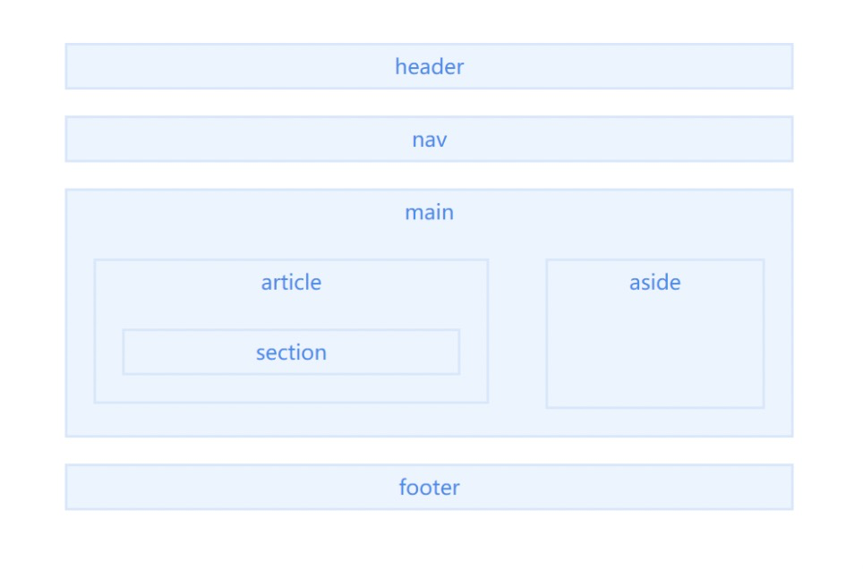

### 未整理前理解口述:
语义化标签是H5新增的一系列具有特定意义的标签, 但其原型仍是`
`标签 
通过对div标签的特殊命名, 从而提高代码可读性、利于SEO 
常见的语义化标签有`header`,`nav`,`main`, `footer` 

### 什么是语义化标签?
> 语义是指对一个词或者句子含义的正确解释。
> 很多 *HTML* 标签也具有语义的意义，也就是说元素本身传达了关于标签所包含内容类型的一些信息。
> 例如，当浏览器解析到`<h1></h1>`标签时，它将该标签解释为包含这一块内容的最重要的标题。*h1* 标签的语义就是用它来标识特定网页或部分最重要的标题。

说人话：
  元素本身传达了关于标签所包含内容类型的一些信息。即看到这个标签，你就大概知道它代表什么含义

### 语义化标签的意义
- 代码结构：使页面没有CSS的情况下，也能够呈现很好的内容结构
- 有利于SEO：爬虫可以依赖标签确定关键字的权重，因此可以和搜索引擎建立良好的沟通，帮助爬虫获取更多有效的信息
- 便于团队开发和维护（提升可读性）：使得其他人阅读代码时能够迅速理解代码的结构，减少差异化
- 方便其他设备解析：*盲人阅读器*、*移动设备*等

### 语义化标签有哪些?

- header：用于定义页面的头部区域，通常包括网站 logo、主导航、全站链接以及搜索框。
- nav：定义页面的导航链接部分区域。
- main：定义文档的主要内容，该内容在文档中应当是独一无二的
- article：定义页面独立的内容，它可以有自己的 header、footer、sections 等，专注于单个主题的博客文章，报纸文章或网页文章。
- section：表示文档中的一个区域（或节），比如，内容中的一个专题组。
- aside：表示一个和其余页面内容几乎无关的部分，被认为是独立于该内容的一部分且可以被单独的拆分出来而不会影响整体。通常表现为侧边栏或嵌入内容。
- footer：定义最近一个章节内容或者根节点元素的页脚。一个页脚通常包含该章节作者、版权数据或者与文档相关的链接等信息。

