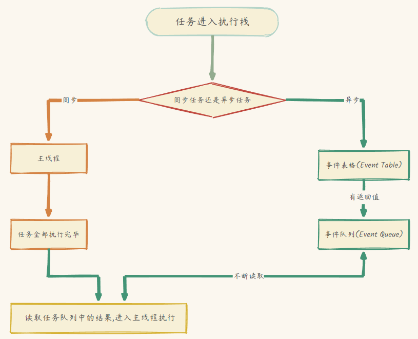
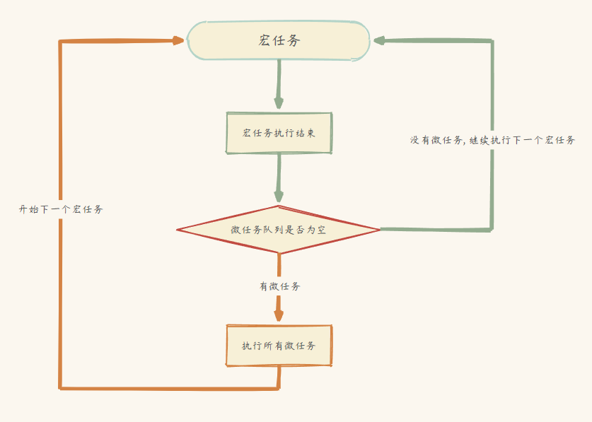
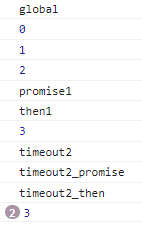

### 什么是事件循环(Event Loop)?
众所周知, `Javascript`是一门单线程的语言, 单线程即同一时间只能做一件事, 但这并不意味着`JavaScript`在执行代码的过程中就会一直阻塞,而解决单线程不阻塞的这个机制就叫做`事件循环(Event Loop)`, 也就是`同步`和`异步`的概念.

### 任务执行流程
在JS中, 所有的任务都可以分为了`同步任务`和`异步任务`
- 同步任务: 立即执行的任务, 且只有上一个同步任务执行完毕, 才会执行下一个任务

    > 同步方法调用一旦开始，调用者必须等到方法调用返回后，才能继续后续的行为。
- 异步任务: 即在任务执行时不能立刻得到结果, 而是需要在将来通过一定的手段获取, 则称之为异步任务, 例如网络请求, 定时器, 计时器等

    > 异步方法调用更像一个消息传递，一旦开始，方法调用就会立即返回，调用者就可以继续后续的操作。而，异步方法通常会在另外一个线程中，“真实”地执行着。整个过程，不会阻碍调用者的工作。

同步任务与异步任务的运行流程图如下:
<div style="display:flex; justify-content:center;">
    
</div>

从上图可以看到, 同步任务和异步任务分别进入不同的执行环境, 同步任务进入主线程, 即主执行栈, 异步任务进入任务队列. 主线程内的任务执行完毕至为空时, 回去任务队列读取对应的任务, 推入主线程执行. 上述过程的不断重复就称之为`事件循环(Event Loop)`

### 宏任务和微任务
在异步任务中并不像同步任务按顺序执行, 而是再细分为`宏任务(macro-task)`和`微任务(micro-task)`

每一次`Event Loop`触发并开始执行异步任务时, 流程如下:

<div style="display:flex; justify-content:center;">
    
</div>

总结就是:
- 执行一个宏任务时, 遇到微任务, 会把微任务加入到微任务的事件队列中
- 当宏任务执行完成后, 再开始依次执行微任务事件队列中的所有微任务

常见的宏任务有:
- setTimeout/setInterval
- script(可以理解为外层的同步代码)
- I/O操作(node.js)

常见的微任务有:
- Promise的方法
- Object.observe(已废弃, Proxy对象替代)
- process.nextTick(node.js)
- MutaionObserver

### 实战
读万卷书, 行万里路, 有没有理解掌握, 实战一下便知
```js
console.log('global')

for (var i = 0;i < 3;i ++) {
  setTimeout(function() {
    console.log(i)
  },i*1000)
  console.log(i)
}

new Promise(function (resolve) {
  console.log('promise1')
  resolve()
 }).then(function () {
  console.log('then1')
})

setTimeout(function () {
  console.log('timeout2')
  new Promise(function (resolve) {
    console.log('timeout2_promise')
    resolve()
  }).then(function () {
    console.log('timeout2_then')
  })
}, 0)
```
分析: 
1. 从上往下执行, 第一个同步任务, 输出'global'
2. 进入循环, 遇到`setTimeout`, 将其回调函数加入到异步任务队列中<br>
    - EventTable: [`setTimeout(1s)`, `setTimeout(2s)`, `setTimeout(3s)`]
3. 执行log函数, 输出i, 注意这里使用`var`声明的i
4. 循环三次, 所以依次输出0, 1, 2
5. 执行Promise, 执行log函数, 输出'promise1'
6. 将Promise.then加入到异步任务队列中 <br>
    - EventTable: [ `setTimeout(0ms)`, `setTimeout(1000ms)`, `setTimeout(3000ms)`, `Promise.then` ] 
    - 宏任务队列: []
    - 微任务队列: [ `Promise.then` ]
7. 将setTimeout加入到异步任务列中
    - EventTable: [ `setTimeout1(0ms)`, `setTimeout1(1000ms)`, `setTimeout1(3000ms)`,` Promise.then`, `setTimeout2(0ms)` ] 
    - 宏任务队列: []
    - 微任务队列: [ `Promise.then` ]
8. 先执行微队列中的任务, 输出'then1'
    - EventTable: [`setTimeout1(0ms)`, `setTimeout1(1000ms)`, `setTimeout1(3000ms)`, `setTimeout2(0ms)`] 
    - 宏任务队列: []
    - 微任务队列: []
9. 微队列清空, 开始宏队列, 执行setTimeout的回调函数, 因为是`var`声明的遍历, 所以此时的i已经变成3, 输出`setTimeout1(0ms)`的3
    - EventTable: [ `setTimeout1(1000ms)`, `setTimeout1(3000ms)`, `setTimeout2(0ms)` ] 
    - 宏任务队列: []
    - 微任务队列: []
10. 根据时间顺序, Event Table中下一个执行的是`seTimeout2(0ms)`, 执行log函数, 输出'timeout2'
11. 执行Promise的函数体, 输出'timeout2_promise'
    - EventTable: [ `setTimeout1(1000ms)`, `setTimeout1(3000ms)`,  ] 
    - 宏任务队列: []
    - 微任务队列: [ `Promise2.then` ]
12. 执行Promise.then, 输出'timeout2_then'
    - EventTable: [ `setTimeout1(1000ms)`, `setTimeout1(3000ms)` ] 
    - 宏任务队列: []
    - 微任务队列: []
13. 依次执行定时器, 输出3, 3


输出:


