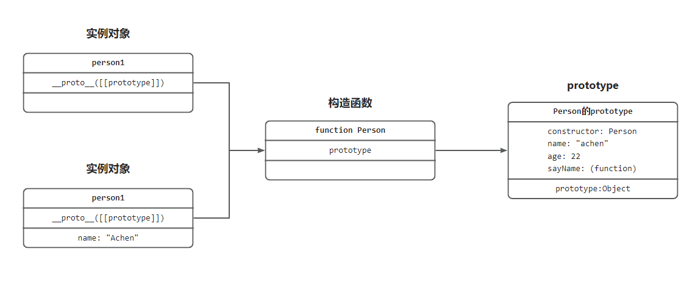

### 构造函数

众所周知,`JavaScript`中的复杂类型都是对象类型(Object), 而`javaScript`并不是一门完全面向对象编程的语言, 所以涉及到面向对象编程, 例如继承机制, 这就是一个问题, 因此就出现了`构造函数`

因为`js`中**没有**`类(class)`这个概念, 所以`js`使用`构造函数`来实现`继承`机制
> ps: 即使ES6中出现class关键字, 但其实它可以看作是一个语法糖, 让js在写法上更加清晰和更加像面向对象编程的语法

```js
// 构造函数
function Person() {}
Person.prototype.name = 'achen'
Person.prototype.age = 23
Person.prototype.sayName = function() {
    console.log(this.name);
}

// 生成实例
let person1 = new Person()
let person2 = new Person()
person1.name = "Achen"
```
`js`通过`构造函数`来生成实例, 但是问题在于`构造函数`中通过`this`赋值的属性和方法, 是每个实例的实例属性和实例方法, 而不是公共的属性和方法. 为了解决这个问题, 就设计出了`原型对象`, 用来存储`构造函数`的公共属性和方法
### 原型对象

`js`的每个函数在创建时都会生成一个属性`prototype`, 这个属性指向一个对象, 这个对象就是此函数的`原型对象`. `原型对象`中有个`constructor`, 指向该函数, 这样`原型对象`和`它的函数`之间就产生了联系

### \_\_proto\_\_
> `__proto__`并不是语言本身的特性，这是各大厂商具体实现时添加的私有属性，虽然目前很多现代浏览器的 JS 引擎中都提供了这个私有属性，但依旧不建议在生产中使用该属性，避免对环境产生依赖。生产环境中，我们可以使用 `Object.getPrototypeOf` 方法来获取实例对象的原型，然后再来为原型添加方法/属性。（摘自阮一峰的ES6入门）

每个通过`构造函数`创建出来的`实例对象`, 其本身有个属性`__proto__`(有的浏览器也是直接显示为`[[prototype]]`), 这个属性指向`实例对象`的`构造函数`, 图片可能会更加直观


### 原型链
当访问与一个`对象`的某个属性时, 会现在这个对象本身属性上查找, 如果没有找到就会通过它的`__proto__`找到它的原型对象, 如果还没有找到, 就会在其构造函数的prototype的__proto__中查找, 这样一层一层向上查找就会形成一个链式结构, 它就称之为`原型链`
```js
// 生成实例
let person1 = new Person()
let person2 = new Person()
person1.name = "Achen"

console.log(person1.name) // 寻找自身属性, 包含name, 所以返回"Achen"
console.log(person2.name) // 寻找自身属性, 没有找到, 通过[[prototype]]找到原型对象, 包含name, 返回"achen"

person1.sayName() // "Achen"
person2.sayName() // "achen"
```

### 面试题: new一个实例的过程发生了什么?
1. 创建一个新对象
2. 新对象会被执行`[[prototype]]`连接
3. 将构造函数的作用域赋值给新对象(这样this就指向了新对象)
4. 执行构造函数中的代码(为新对象添加实例属性和实例方法)
5. 返回新对象

```js
function Person(name, age) {
    this.name = name
    this.age = age
}
// 生成实例
const person = new Person("achen", 22)

// 结合上面的例子, 伪代码如下
// 1. 创建一个新对象 
   person =  {}
// 2. 新对象会被执行[[prototype]]连接 
   person.[[protype]] = Person.prototype
// 3. 将构造函数的作用域赋值给新对象
   Person.call(person, "achen", 22)
// 4. 执行构造函数中的代码
   person.name = "achen"
   person.age = 22
// 5. 返回新对象
   return {name: "achen", age: 22, [[prototype]]: Person}

```

### 参考文章
1. 红宝书
2. [掘金-一文搞懂JS原型与原型链（超详细，建议收藏）](https://juejin.cn/post/6984678359275929637)